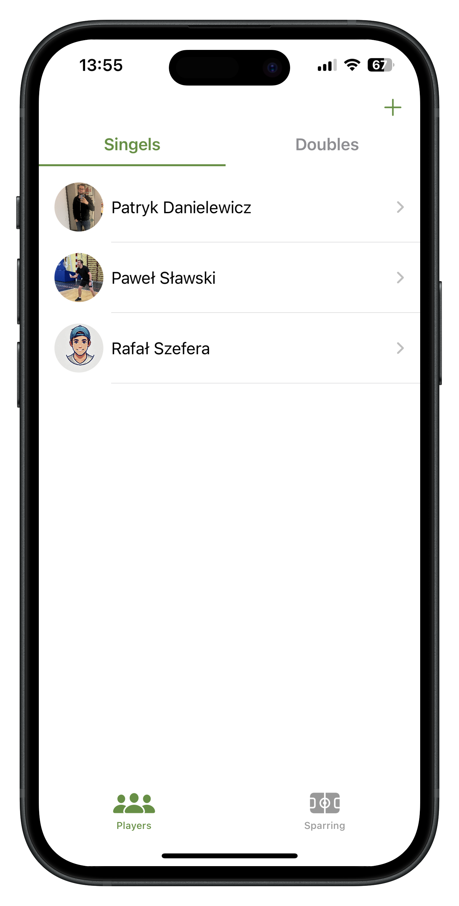
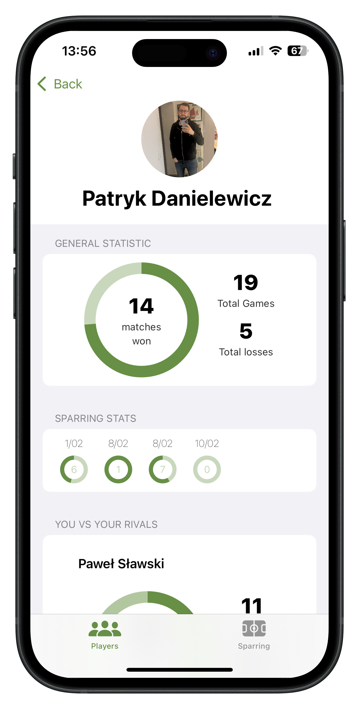
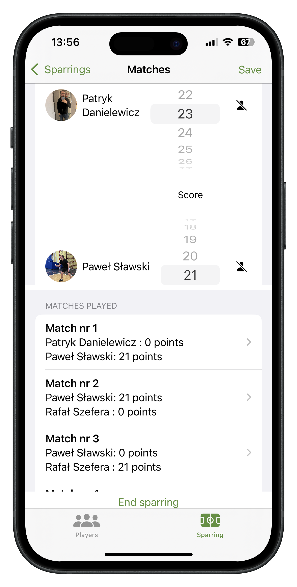
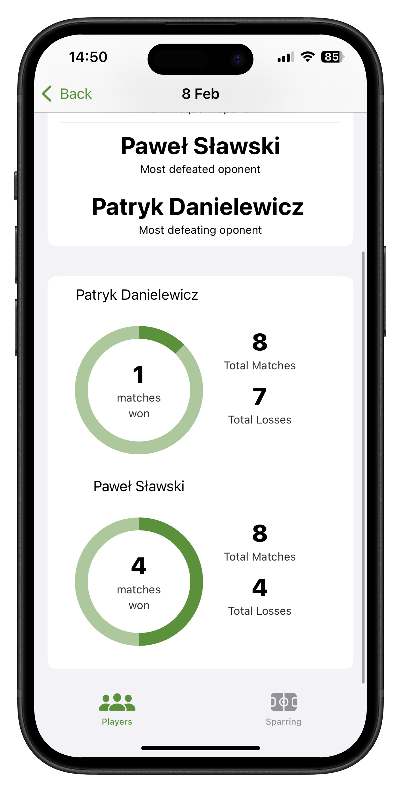
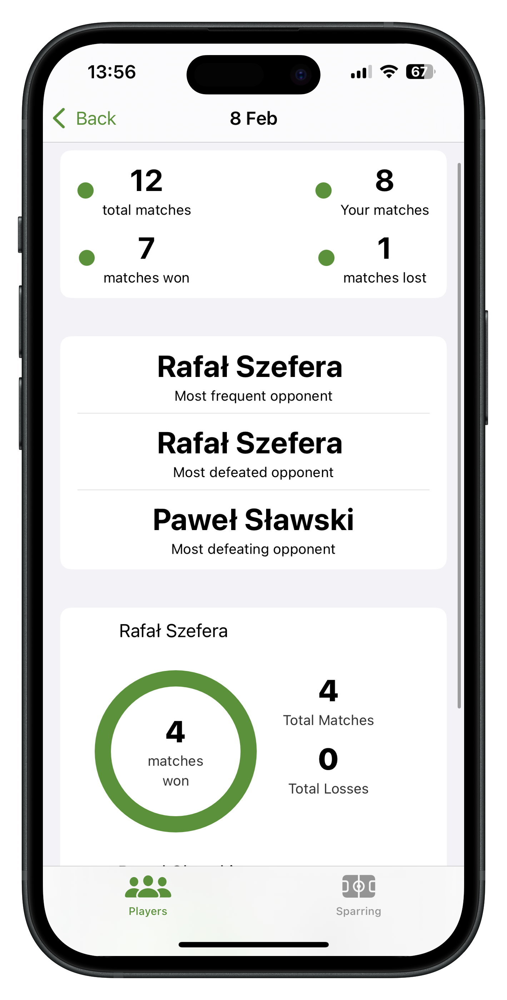
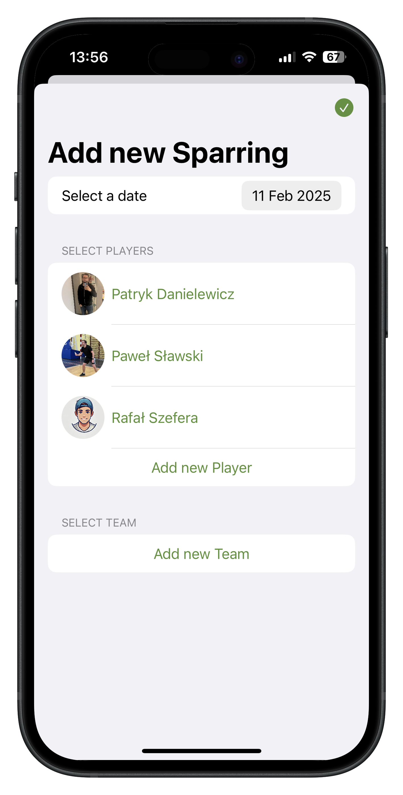

# WinCounter

## 📌 Overview
**WinCounter** is a **badminton score tracking** application that allows players to count points, store match results, and analyze game statistics. The app is designed for individual players and teams who want to track their performance over time.

## 🎯 Features
- **MVVM** – Implemented MVVM architecture for better separation of concerns
- **Cloud Sync via CoreData & iCloud** – Keep your match history safe and accessible on multiple devices.
- **Combine** – Uses Combine for reactive programming and real-time data updates.
- **Dependency Injection (DI)** – Fully compatible with Dependency Injection (DI) to improve testability and maintainability.
- **Match Score Tracking** – Easily track match scores and update points dynamically.
- **Player & Team Management** – Add individual players or teams and organize matches.
- **Match History & Statistics** – View past matches and performance breakdowns.
- **Head-to-Head Statistics** – Compare your results against different opponents.

- **Apple Watch Integration** – Quickly check and update match scores from your wrist.
- **Dark Mode Support** – Enjoy a seamless experience in both light and dark modes.

## 📊 Data Storage & Synchronization
- **CoreData + iCloud Sync**: Match results, players, and statistics are securely stored and synced across devices.

## 🔧 Technologies Used

- **Swift & SwiftUI** – Modern UI development with a reactive approach.
- **CoreData** – Local and cloud-based data storage with iCloud integration.
- **Charts & Data Visualization** – Custom charts to analyze player performance.
- **Combine Framework** – Reactive programming for real-time updates.
- **Apple Watch Integration** – Score tracking directly from watchOS.

## 📸 Screenshots

###  Players View 

###  Players Statistic 

###  Match View 

###  Opponents Statistic

###  Sparring Statistic

###  Add New Sparring

###  Apple Watch 

## 🔮 Future Improvements
- **Real-time Multiplayer Mode**
- **Tournament Bracket Generator**
- **More Detailed Player Analytics**

## 📜 License
This project is open-source and available under the **MIT License**.

## 🤝 Contact
Developed by **Patryk Danielewicz** – [LinkedIn Profile](https://www.linkedin.com/in/patryk-danielewicz-3811a5176/)

